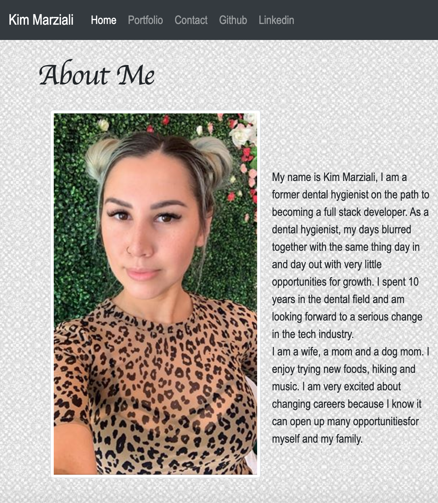
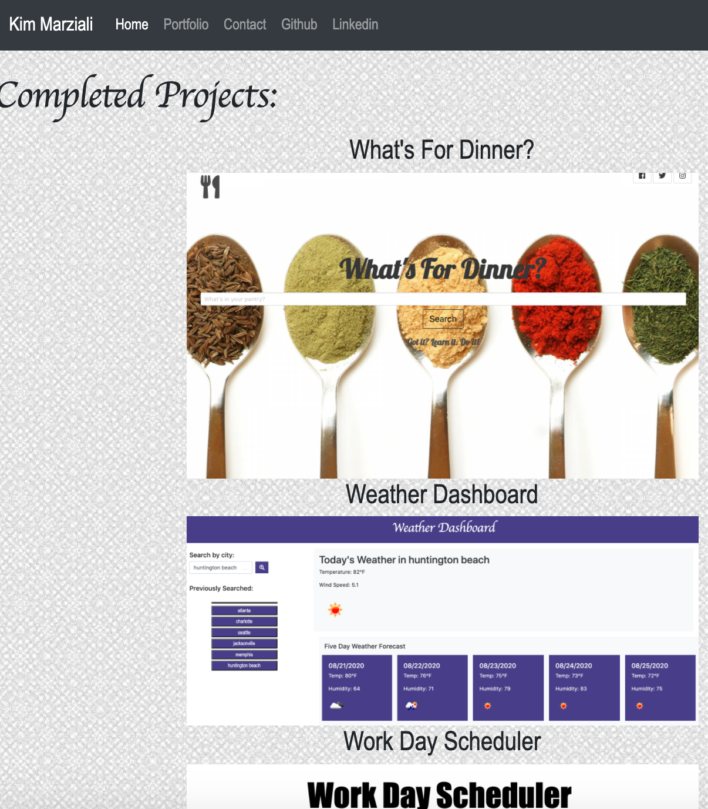
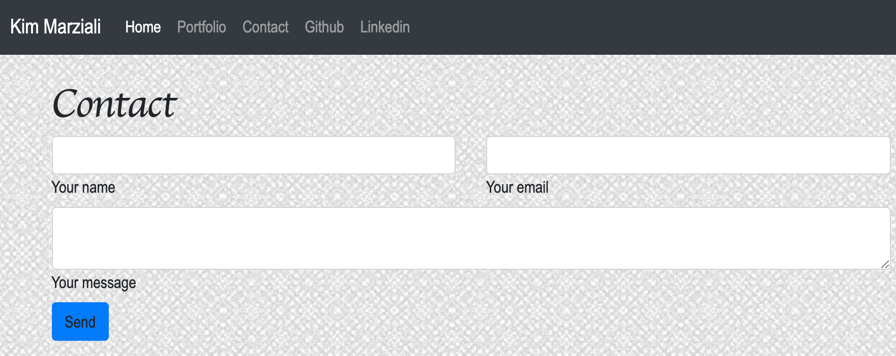

#first-portfolio

description:
This is my edited and updated version of my portfolio.
My original portfolio did not have css at all, this one has been improved by using css and bootstrap.

Deployed links: https://kmarzi.github.io/updated-portfolio/.

##Project 1: https://kmarzi.github.io/Project-1/
My group created an application that allows you to search for recipe ideas based on what is currently in your pantry. Once you type in the ingredients that you have it shows you a list of recipes and also brings up a carousel of videos that you can choose from if you are interested in watching someone make the recipe.

